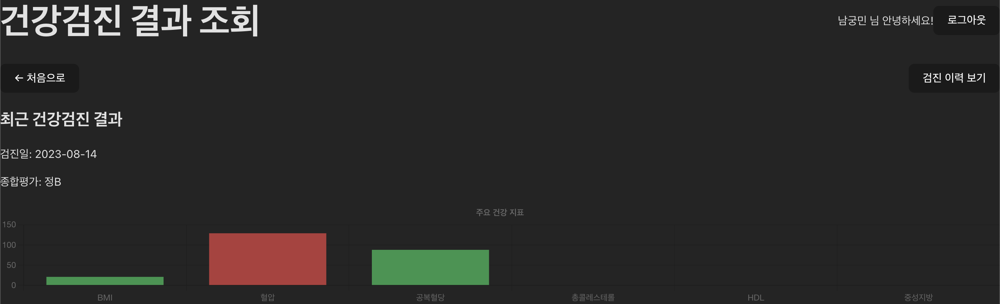

# Health Checkup

## 목차

- [주요 기능](#주요-기능)
- [기술 스택](#기술-스택)
- [시작하기](#시작하기)
- [실행 방법](#실행-방법)
- [배포](#배포)
- [프로젝트 구조](#프로젝트-구조)

## 주요 기능

### 1. 사용자 인증

- 간편한 이름 입력으로 서비스 시작
- Zustand를 활용한 세션 상태 관리

### 2. 건강검진 정보 조회

- 생년월일과 휴대폰 번호로 건강검진 정보 조회
- 조회 기간 설정 (시작 연도 ~ 종료 연도)

### 3. 본인 인증

- 휴대폰 인증을 통한 본인 확인

### 4. 건강검진 결과 대시보드

- **주요 건강 지표 시각화**

  - BMI (체질량지수)
  - 혈압
  - 공복혈당
  - 총콜레스테롤
  - HDL 콜레스테롤
  - 중성지방

- **Chart.js 기반 인터랙티브 차트**

  - 막대 그래프로 보는 건강 지표
  - 건강 상태별 색상 구분 (정상/주의/위험)

- **건강 상태 자동 판단**

  - 정상 범위 기준 자동 판별
  - 주의/위험 단계 알림

- **기타 검사 결과**
  - 신장, 체중, 허리둘레
  - 시력, 청력
  - 요단백 검사
  - 흉부 X선 검사
  - 혈색소 수치

### 5. 검진 이력 관리

- 전체 건강검진 이력 조회
- 각 검진별 상세 정보 펼쳐보기
- 검진 기관 정보 확인
- 최신 검진 강조 표시

## 기술 스택

### Frontend

- **React 19** - 최신 React 기능 활용
- **TypeScript** - 타입 안정성 및 개발 생산성 향상
- **Vite** - 빠른 개발 서버 및 빌드 도구
- **TailwindCSS 4** - 유틸리티 우선 CSS 프레임워크

### 데이터 시각화

- **Chart.js 4** - 건강 지표 차트 렌더링
- **react-chartjs-2** - React용 Chart.js 래퍼

### 상태 관리

- **Zustand** - 경량 상태 관리 라이브러리

### 개발 도구

- **ESLint** - 코드 품질 관리
- **Vitest** - 단위 테스트 프레임워크
- **Testing Library** - React 컴포넌트 테스트

### 배포 및 인프라

- **Docker** - 컨테이너화
- **Nginx** - 프로덕션 웹 서버
- **Vercel** - 서버리스 배포 플랫폼

## 시작하기

### 사전 요구사항

- Node.js 20 이상
- npm 또는 yarn
- Docker (선택사항)

### 환경 변수 설정

1. `.env.example` 파일을 복사하여 `.env` 파일을 생성합니다:

```bash
cp .env.example .env
```

2. `.env` 파일을 열어 API 키를 설정합니다:

```bash
VITE_API_KEY=your_api_key_here
```

## 실행 방법

### 로컬 개발 환경

```bash
# 1. 의존성 설치
npm install

# 2. 개발 서버 실행
npm run dev
```

개발 서버가 http://localhost:5173 에서 실행됩니다.

### 프로덕션 빌드

```bash
# 프로덕션 빌드 생성
npm run build

# 빌드 결과 로컬에서 미리보기
npm run preview
```

### 테스트 실행

```bash
# 인터랙티브 모드로 테스트 실행
npm test

# 테스트 UI (브라우저)
npm run test:ui

# CI 환경용 1회 실행
npm run test:run
```

### Docker로 실행하기

#### 방법 1: Docker Compose 사용 (권장)

**개발 환경**

```bash
# 개발 서버 시작
docker-compose up dev

# 백그라운드 실행
docker-compose up -d dev

# 로그 확인
docker-compose logs -f dev
```

http://localhost:5173 에서 접속 가능

**프로덕션 환경**

```bash
# 프로덕션 서버 시작
docker-compose up prod

# 백그라운드 실행
docker-compose up -d prod
```

http://localhost:8080 에서 접속 가능

#### 방법 2: Docker 직접 사용

```bash
# 1. 프로덕션 이미지 빌드
docker build -t health-checkup:latest .

# 2. 컨테이너 실행
docker run -p 8080:80 health-checkup:latest

# 3. 환경 변수와 함께 실행
docker run -p 8080:80 -e VITE_API_KEY=your_key health-checkup:latest
```

#### Docker 컨테이너 관리

```bash
# 컨테이너 중지
docker-compose down

# 컨테이너 및 볼륨 삭제
docker-compose down -v

# 이미지 재빌드
docker-compose up --build
```

## 프로젝트 구조

```
health-checkup/
├── src/
│   ├── components/              # React 컴포넌트
│   │   ├── Dashboard.tsx        # 건강검진 결과 대시보드
│   │   ├── Header.tsx           # 공통 헤더
│   │   ├── History.tsx          # 검진 이력 조회
│   │   ├── SearchForm.tsx       # 건강검진 정보 입력 폼
│   │   └── VerificationWaiting.tsx  # 본인 인증 대기 화면
│   ├── store/                   # 상태 관리
│   │   └── authStore.ts         # 사용자 인증 상태 (Zustand)
│   ├── types/                   # TypeScript 타입 정의
│   │   └── healthCheckup.ts     # 건강검진 데이터 타입
│   ├── App.tsx                  # 메인 앱 컴포넌트
│   ├── App.css                  # 전역 스타일
│   └── main.tsx                 # 애플리케이션 엔트리 포인트
│
├── public/                      # 정적 파일
│   └── vite.svg
│
├── test/                        # 테스트 파일
│   ├── setup.ts                 # 테스트 설정
│   └── *.test.tsx               # 컴포넌트 테스트
│
├── Dockerfile                   # 프로덕션 Docker 설정
├── Dockerfile.dev               # 개발용 Docker 설정
├── docker-compose.yml           # Docker Compose 오케스트레이션
├── nginx.conf                   # Nginx 웹 서버 설정
├── vercel.json                  # Vercel 배포 설정
│
├── vite.config.ts               # Vite 빌드 도구 설정
├── tsconfig.json                # TypeScript 설정
├── tailwind.config.js           # TailwindCSS 설정
├── eslint.config.js             # ESLint 설정
│
├── package.json                 # 프로젝트 메타데이터 및 의존성
├── .env.example                 # 환경 변수 예시
├── .gitignore                   # Git 제외 파일 목록
└── README.md                    # 프로젝트 문서
```

## API 프록시 설정

모든 환경에서 `/api` 경로로 들어오는 요청은 `https://api.candiy.io`로 자동 프록시됩니다.

### 환경별 프록시 구성

| 환경            | 프록시 방법           | 설정 파일        |
| --------------- | --------------------- | ---------------- |
| 로컬 개발       | Vite Dev Server Proxy | `vite.config.ts` |
| Docker 프로덕션 | Nginx Reverse Proxy   | `nginx.conf`     |
| Vercel          | Vercel Rewrites       | `vercel.json`    |

### 프록시 동작 예시

```
클라이언트 요청: /api/v1/nhis/checkup
    ↓
프록시 처리
    ↓
실제 요청: https://api.candiy.io/v1/nhis/checkup
```

### CORS 처리

프록시 설정을 통해 CORS 문제를 해결하며, `changeOrigin: true` 옵션으로 Origin 헤더를 자동으로 조정합니다.

## 주요 명령어

```bash
# 개발
npm run dev              # 개발 서버 실행
npm run build            # 프로덕션 빌드
npm run preview          # 빌드 미리보기

# 테스트
npm test                 # 테스트 실행
npm run test:ui          # 테스트 UI
npm run test:run         # CI용 테스트

# 코드 품질
npm run lint             # ESLint 실행

# Docker
docker-compose up dev    # Docker 개발 환경
docker-compose up prod   # Docker 프로덕션 환경
```

## 배포 URL

https://health-checkup-rouge.vercel.app/

## 건강검진 대시보드 화면


